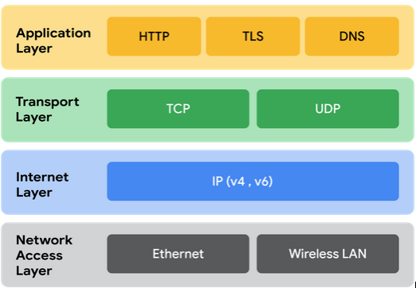
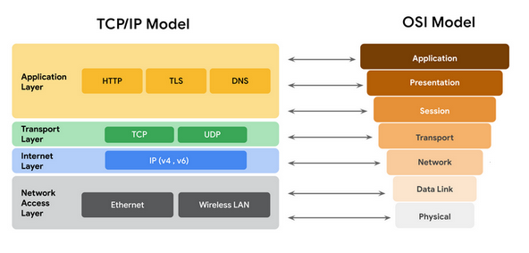

# Tipos de Redes de Computadores - Curso 03 - Módulo 01

## LAN (Local Area Network)
Rede de área local que conecta dispositivos em um espaço físico limitado, como uma residência, escritório ou escola.

### Características:
- Abrange pequenas áreas geográficas.
- Geralmente é de propriedade privada.
- Alta velocidade de transmissão (até 1 Gbps ou mais em redes modernas).

**Exemplo:** Uma rede que conecta computadores e impressoras em um escritório.

---

## WAN (Wide Area Network)
Rede de área ampla que interliga várias redes locais (LANs) em grandes distâncias, como entre cidades, países ou continentes.

### Características:
- Abrange áreas geográficas extensas.
- Pode usar infraestrutura pública (como a Internet) ou privada.
- Velocidades variáveis, dependendo da tecnologia utilizada.

**Exemplo:** A Internet é a maior WAN existente.

---

## MAN (Metropolitan Area Network)
Rede de área metropolitana que conecta várias LANs dentro de uma cidade ou região metropolitana.

### Características:
- Abrange áreas maiores que uma LAN, mas menores que uma WAN.
- Geralmente utilizada por empresas ou governos para interligar prédios ou bairros.
- Frequente uso de tecnologias de fibra ótica para alta velocidade.

**Exemplo:** Redes que conectam agências bancárias em uma cidade.

---

## PAN (Personal Area Network)
Rede pessoal que conecta dispositivos próximos a um indivíduo.

### Características:
- Alcance curto, geralmente até 10 metros.
- Usa tecnologias como Bluetooth ou USB.

**Exemplo:** Conexão entre um smartphone e um smartwatch.

---

## WLAN (Wireless Local Area Network)
Versão sem fio de uma LAN, permitindo que dispositivos se conectem por meio de Wi-Fi.

### Características:
- Sem necessidade de cabos físicos.
- Abrange o mesmo espaço físico que uma LAN.

**Exemplo:** Rede Wi-Fi de uma casa ou cafeteria.

---

## SAN (Storage Area Network)
Rede de armazenamento que conecta servidores a dispositivos de armazenamento de dados.

### Características:
- Usada em datacenters e grandes empresas.
- Focada em alta performance para transferência de dados.

**Exemplo:** Rede que conecta servidores a sistemas de backup em uma empresa.

---

## Dispositivos de Rede e Suas Funções
Os dispositivos de rede são essenciais para conectar e manter a comunicação entre os diversos dispositivos de uma rede. Eles gerenciam o tráfego de dados, fornecem serviços e garantem a segurança e o desempenho da rede.

### Dispositivos de Rede Comuns
1. **Computadores e Dispositivos Móveis:**
   - Cada dispositivo possui um endereço MAC e um endereço IP únicos.
   - Podem se conectar à rede via cabo ou sem fio.

2. **Firewalls:**
   - Monitoram e controlam o tráfego de rede, protegendo contra ameaças externas.
   - Configurados com regras para determinar o que pode ou não passar.

3. **Servidores:**
   - Fornecem serviços e recursos como arquivos ou e-mails para dispositivos (clientes).
   - Exemplos: servidores DNS, de arquivos e de e-mail.

4. **Hubs e Switches:**
   - **Hub:** Dispositivo simples que transmite dados para todas as portas conectadas.
   - **Switch:** Mais eficiente, envia dados apenas ao destino, melhorando o desempenho.

5. **Roteadores:**
   - Conectam redes diferentes e direcionam pacotes com base no endereço IP.
   - Podem incluir funcionalidades de firewall.

6. **Modem e Ponto de Acesso Sem Fio:**
   - **Modem:** Converte sinais digitais da Internet em sinais analógicos e vice-versa.
   - **Ponto de Acesso Sem Fio:** Permite comunicação sem fio criando redes Wi-Fi.

---

## Diagramas de Rede e Segurança
### Função:
Diagramas mostram dispositivos, conexões e ajudam a planejar estratégias de segurança, analisar incidentes e implementar medidas corretivas.

---

## O Modelo TCP/IP
Estrutura usada para organizar e transmitir dados em redes, com quatro camadas:

1. **Camada de Acesso à Rede (Enlace de Dados):**
   - Lida com a transmissão física de dados.
   - Protocolos: ARP (mapeamento de endereços IP para MAC).

2. **Camada de Internet (Rede):**
   - Garante entrega de pacotes ao destino.
   - Protocolos: IP, ICMP.

3. **Camada de Transporte:**
   - Gerencia entrega confiável ou não de dados.
   - Protocolos: TCP (confiável) e UDP (não confiável).

4. **Camada de Aplicação:**
   - Interface entre usuários e a rede.
   - Protocolos: HTTP, SMTP, SSH, FTP, DNS.

# Modelo TCP/IP vs Modelo OSI

## Semelhanças
- Ambos dividem a comunicação em camadas para padronizar e organizar os processos de rede.
- Facilitam o diagnóstico e a resolução de problemas de rede.

## Diferenças
- As camadas de aplicação, apresentação e sessão no OSI são agrupadas na camada de aplicação do TCP/IP.
- A camada de enlace e física do OSI estão unidas na camada de acesso à rede do TCP/IP.

---

# Estrutura do Pacote IPv4

Um pacote IPv4 consiste em:
- **Cabeçalho**: 20-60 bytes, contendo informações como:
  - Endereços IP de origem e destino.
  - Protocolo usado.
  - Comprimento do pacote.
- **Seção de Dados**: Tamanho variável (até 65.535 bytes), contendo a mensagem real.

---

# IPv4 vs IPv6

- **IPv6** foi introduzido para resolver as limitações do IPv4, como o esgotamento de endereços IP.
- **Tamanho dos endereços**:
  - IPv4: 32 bits.
  - IPv6: 128 bits, permitindo muito mais endereços exclusivos.

---

# Módulo 2: Protocolo de Rede

## Definição
Conjunto de regras que descreve a ordem de entrega e a estrutura de dados. Define como os dispositivos devem processar e transmitir informações.

---

## Categorias de Protocolos de Rede

### 1. **Protocolos de Comunicação**
Regem a troca de informações em redes, garantindo recuperação de dados perdidos.
- **TCP**: Protocolo confiável que usa handshake de três vias (camada de transporte).
- **UDP**: Protocolo sem conexão, ideal para transmissões rápidas (camada de transporte).
- **HTTP/HTTPS**: Comunicação entre clientes e servidores de sites. O HTTPS usa criptografia (camada de aplicação).
- **DNS**: Tradução de nomes de domínio para endereços IP (camada de aplicação).

### 2. **Protocolos de Gerenciamento**
Monitoram e gerenciam atividades em redes.
- **SNMP**: Monitora dispositivos em redes (camada de aplicação).
- **ICMP**: Relata erros de transmissão e ajuda no diagnóstico (camada de Internet).

### 3. **Protocolos de Segurança**
Protegem dados em trânsito com criptografia.
- **HTTPS**: Versão segura do HTTP (porta 443).
- **SFTP**: Transferência segura de arquivos via SSH (porta TCP 22).

---

## Protocolos Adicionais

- **NAT**: Permite que dispositivos com IPs privados se comuniquem com a Internet usando um único IP público.
- **DHCP**: Atribui endereços IP exclusivos automaticamente (portas UDP 67 e 68).
- **ARP**: Converte endereços IP em endereços MAC (camada de acesso à rede).
- **Telnet**: Conexão remota insegura (porta TCP 23).
- **SSH**: Conexão remota segura (porta TCP 22).

---

## Protocolos de E-mail
- **POP3**: Recupera e-mails; pode excluí-los do servidor.
  - Portas: TCP/UDP 110 (não criptografado), 995 (SSL).
- **IMAP**: Sincroniza e-mails em dispositivos.
  - Portas: TCP 143 (não criptografado), 993 (TLS).
- **SMTP**: Envio de e-mails.
  - Portas: TCP/UDP 25 (não criptografado), 587 (TLS).

---

# Importância de Conhecer Protocolos e Portas

- Os números de porta definem como dispositivos processam pacotes de dados.
- Firewalls utilizam esses números para filtrar tráfego indesejado.
- Conhecer os protocolos e portas ajuda no diagnóstico de problemas, configuração de redes e garantia de segurança.

---

# Resumo de Portas Relevantes

| Protocolo | Porta         |
|-----------|---------------|
| DHCP      | UDP 67/68     |
| Telnet    | TCP 23        |
| SSH       | TCP 22        |
| POP3      | TCP/UDP 110/995 |
| IMAP      | TCP 143/993   |
| SMTP      | TCP/UDP 25/587 |

---

# A Evolução dos Protocolos de Segurança Sem Fio

Inicialmente, a Internet dependia de cabos físicos para comunicação. Nos anos 1980, a liberação de frequências de rádio nos EUA possibilitou o desenvolvimento de tecnologias sem fio, expandindo o acesso à Internet.

Hoje, o Wi-Fi (baseado nos padrões IEEE 802.11) permite acesso à Internet em dispositivos variados, como smartphones, laptops e dispositivos inteligentes. A segurança dessas redes é garantida por protocolos que evoluíram ao longo dos anos: **WEP**, **WPA**, **WPA2** e **WPA3**.

---

## Protocolos de Segurança Sem Fio

### WEP (1999)
- Criado para oferecer privacidade equivalente às redes com fio.
- Vulnerável a ataques devido à criptografia fraca, considerado de alto risco atualmente.

### WPA (2003)
- Introduziu o protocolo TKIP para resolver falhas do WEP.
- Inclui verificação de integridade de mensagens.
- Ainda vulnerável a ataques KRACK, foi substituído pelo WPA2.

### WPA2 (2004)
- Adotou criptografia AES e o protocolo CCMP para maior segurança.
- Disponível nos modos: pessoal e empresarial.

### WPA3 (2018)
- Resolve vulnerabilidades do WPA2, usando o protocolo SAE e criptografia de 128 ou 192 bits (modo empresarial).
- Protege contra tentativas de decodificação offline e ataques de handshake.

---

## Sub-redes e CIDR

### Sub-redes
- Dividem uma rede maior em redes menores, melhorando a eficiência e a segurança.

### CIDR (Classless Inter-Domain Routing)
- Expande os endereços IPv4 disponíveis e otimiza o roteamento, utilizando máscaras de sub-rede para segmentação.

### Benefícios das Sub-redes:
- Uso eficiente da largura de banda.
- Melhoria no desempenho e segurança.
- Isolamento de segmentos por meio de roteamento e firewalls.

---

## Virtualização de Redes e Privacidade

### Firewalls
- Inspecionam e filtram o tráfego de rede antes de permitir acesso à rede privada.

#### Tipos:
1. **Sem estado**: Opera com regras predefinidas, sem rastrear sessões.
2. **Stateful**: Rastreia sessões usando uma tabela de estado, filtrando ameaças proativamente.

#### NGFWs (Firewalls de Próxima Geração):
- Oferecem inspeção profunda de pacotes.
- Incluem recursos como prevenção de intrusão, sandboxing de malware, antivírus de rede e filtragem de URL/DNS.

### Servidores Proxy
Funcionam como barreiras entre clientes internos e ameaças externas, usando NAT (Tradução de Endereços de Rede).

#### Tipos:
1. **Proxy direto**: Lida com consultas internas para recursos externos.
2. **Proxy reverso**: Gerencia solicitações externas para serviços internos.

### Redes Privadas Virtuais (VPNs)
- Criptografam dados em trânsito e mascaram endereços IP. Utilizam encapsulamento para proteger dados em redes públicas.

#### Tipos de VPNs:
1. **Acesso Remoto**: Conexão entre dispositivo pessoal e servidor VPN pela internet.
2. **Site a Site**: Extende a rede corporativa a locais remotos usando IPsec.
3. **SD-WAN**: Integra recursos de VPN para conexões seguras em várias localizações.
4. **WireGuard**: Protocolo VPN de alta velocidade e criptografia avançada.
5. **IPsec**: Protocolo tradicional amplamente utilizado.

---

## Ataques de Interceptação de Rede

### Exemplos:
1. **Interceptação de Pacotes**: Captura e inspeção de dados em trânsito.
2. **Modificação de Dados**: Alteração de mensagens ou inserção de códigos maliciosos.

#### Impactos:
- **Financeiros**: Custos de reparação, perda de receita e resgates (ransomware).
- **Reputação**: Perda de confiança do público e de clientes.
- **Segurança Pública**: Ataques a sistemas críticos podem afetar cidadãos e governos.

---

## Ataques Backdoor
- Acessos ocultos em sistemas e redes, explorados para:
  - Instalar malware.
  - Realizar ataques de negação de serviço (DoS).
  - Roubar dados ou comprometer configurações de segurança.

---

## Ataque Distribuído de Negação de Serviço (DDoS)
- Uso de múltiplos dispositivos para sobrecarregar um servidor, rede ou aplicação, tornando-os inacessíveis.

#### Exemplo:
- Sites de bancos ou grandes empresas tirados do ar devido ao alto volume de acessos maliciosos.

---

## Ferramentas para Detecção e Análise de Rede

### tcpdump
- Analisador de protocolo de linha de comando.
- Captura e exibe pacotes em tempo real com informações como:
  - Registro de data e hora.
  - IPs de origem e destino.
  - Portas de origem e destino.

#### Usos:
- Identificação de tráfego malicioso.
- Resolução de problemas de desempenho.
- Criação de alertas para ameaças à segurança.

### Outros Analisadores:
- **Wireshark**: Interface gráfica para captura de pacotes.
- **SolarWinds NetFlow** e **ManageEngine OpManager**: Monitoramento empresarial de redes.

---

## Considerações Finais
Os ataques de interceptação e spoofing demonstram a importância de camadas de defesa robustas. Criptografia de dados, políticas de segurança rigorosas e ferramentas avançadas, como firewalls de próxima geração e IDS/IPS, são essenciais para proteger redes e dados.
